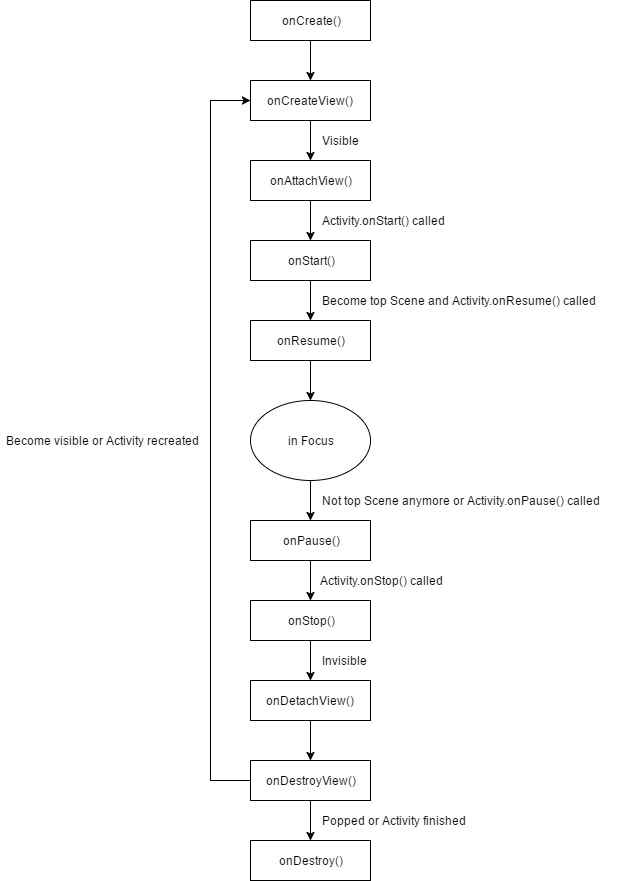

# Stage

Stage is a View-based Android UI framework. It helps you create an app with only one Activity. It learns a lot from [Conductor](https://github.com/bluelinelabs/Conductor).

## Hierarchy


Name | Description
---|---
__Director__ | Director can be hired by Activity or Scene. A Director can direct multiple Stages.
__Stage__ | A Stage holds a Scene stack.
__Scene__ | A Scene is a View wrapper with lifecycle.
__Curtain__ | Curtain show transition between Scenes.

## Scene Lifecycle



Activity lifecycle is integrated to Scene lifecycle. If Activity.onPause() is called, Scene.onPause() is called on all resumed Scenes. If Activity.onStop() is called, Scene.onStop() is called on all started Scenes.

Scene instances are kept after Activity recreated. Instead of recreating Scene instances, onDestroyView() and onCreateView() are called.

## View attaching and detaching

Scene have a property named `Opacity` which describes how this Scene affects the visibility of the Scene just below.

Name | Description
---|---
__Transparent__|The Scene just below is visible
__Translucent__|The Scene just below is only visible if this Scene is the top Scene
__Opaque__|The Scene just below is invisible

For example, a dialog-like Scene is transparent, a swipe-to-finish Scene is translucent.

Stage handles Scene view attaching and detaching according to Scenes' `Opacity` value: attaches the visible, detaches the invisible.

## License

```
Copyright 2017 Hippo Seven

Licensed under the Apache License, Version 2.0 (the "License");
you may not use this file except in compliance with the License.
You may obtain a copy of the License at

    http://www.apache.org/licenses/LICENSE-2.0

Unless required by applicable law or agreed to in writing, software
distributed under the License is distributed on an "AS IS" BASIS,
WITHOUT WARRANTIES OR CONDITIONS OF ANY KIND, either express or implied.
See the License for the specific language governing permissions and
limitations under the License.
```
